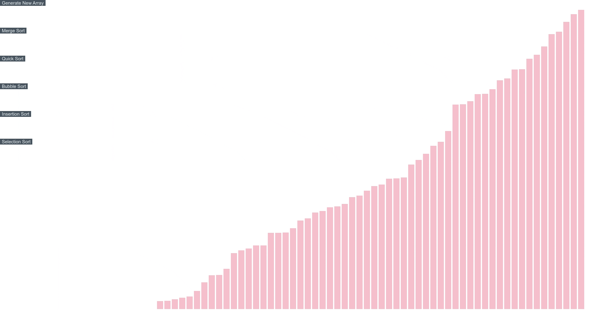

## About

This is a sorting algorithms visulizing application build using reactjs, boot straped using create react app and deployed using gh-pages. Can be used generate array of pseudo random number and to visualize the process of sorting them. Currently supports sorting algorithms such as Bubble Sort, Merge Sort, Quick Sort, Insertion Sort and Selection Sort.

## Demo

## Todo
* Implement Heap Sort
* Counting Sort
* Make UI Better
